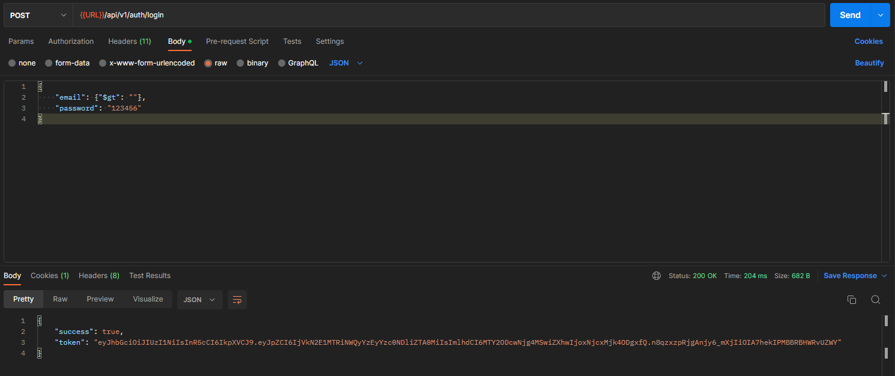
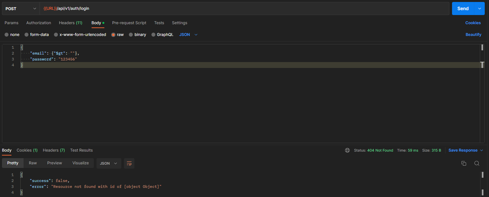
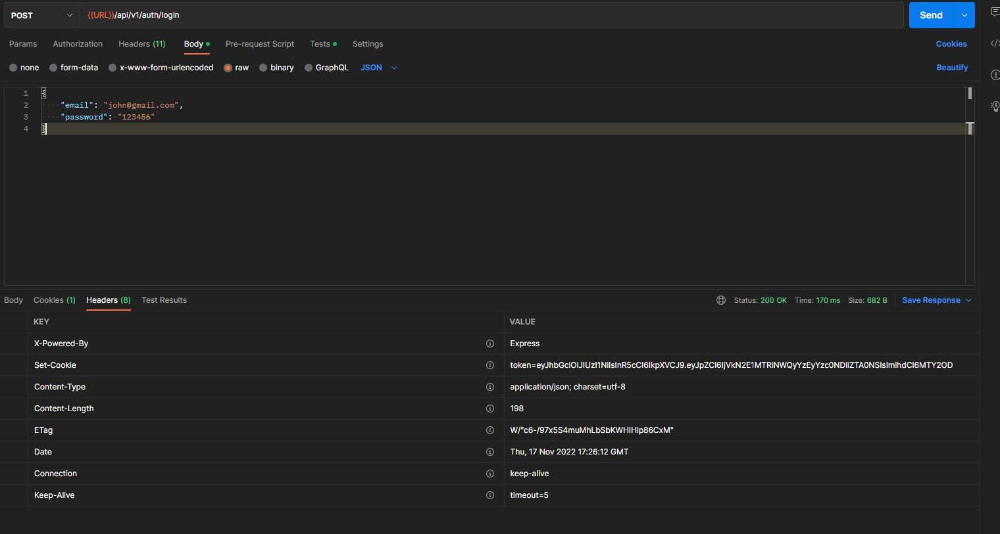
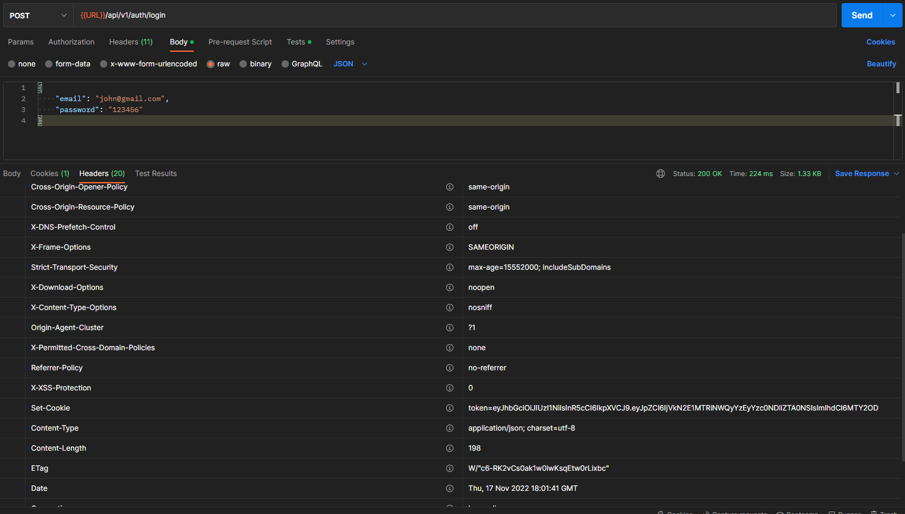
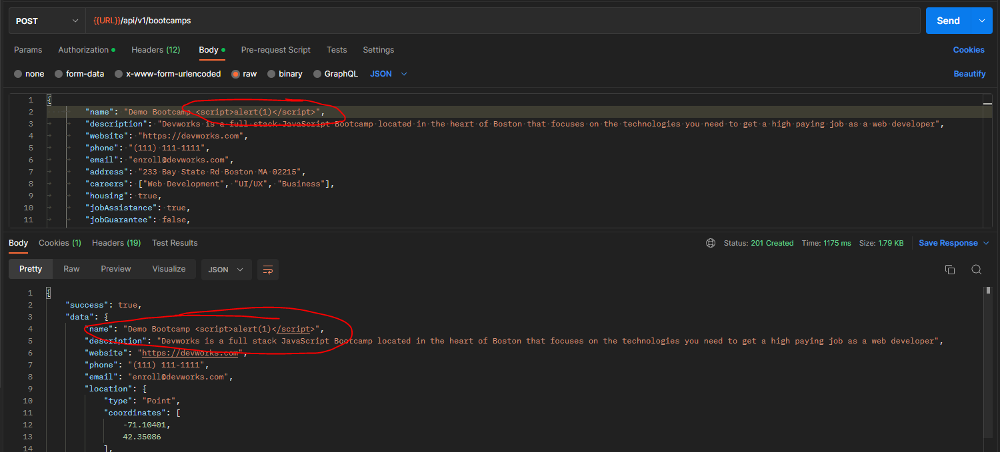
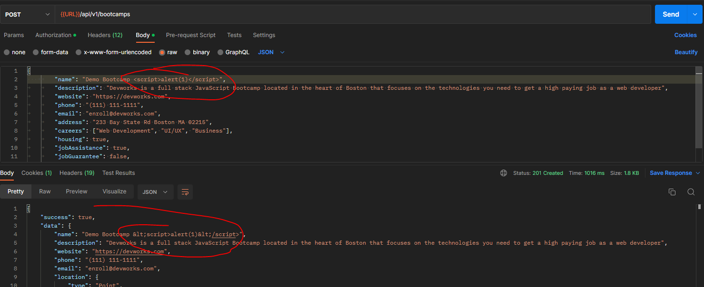
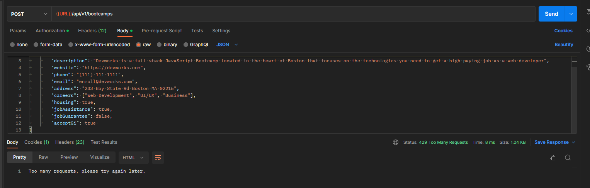

# DevCamper-API-NodeJS

> Backend REST API for DevCamper application, which is a bootcamp directory website and MongoDB, Express, NodeJS, and some other packages and is a public application.

- MongoDB API's w/ database queries
- User can only create a only a single bootcamp ( Admins can create multiple bootcamps )
- NodeMailer for sending emails [nodemailer](https://www.npmjs.com/package/nodemailer)
- Authentication with JWT using [jsonwebtoken](https://www.npmjs.com/package/jsonwebtoken) with cookies
- SQL injection prevention with [express-mongo-sanitize](https://www.npmjs.com/package/express-mongo-sanitize)
- HTTP Headers added using [helmetjs](https://helmetjs.github.io/)
- [xss-clean](https://www.npmjs.com/package/xss-clean) for XSS prevention to sanitize user input coming from POST body, GET queries, and url params
- [express-rate-limit](https://www.npmjs.com/package/express-rate-limit) for rate limiting
- [hpp](https://www.npmjs.com/package/hpp) for HTTP Parameter Pollution
- [cors](https://www.npmjs.com/package/cors) for Cross-Origin Resource Sharing
- HTML Documentation with [docgen](https://github.com/thedevsaddam/docgen)

# Table of Contents

- [DevCamper-API-NodeJS](#devcamper-api-nodejs)
- [Table of Contents](#table-of-contents)
- [Introduction](#introduction)
  - [Packages and Installs (playground)](#packages-and-installs-playground)
  - [What is HTTP?](#what-is-http)
- [Important Points](#important-points)
  - [Import HTTP Status Codes](#import-http-status-codes)
  - [HTTP Request Methods](#http-request-methods)
  - [RESTFUL API Standards](#restful-api-standards)
- [DevCamper Backend API Specifications](#devcamper-backend-api-specifications)
    - [Bootcamps](#bootcamps)
    - [Courses](#courses)
    - [Reviews](#reviews)
    - [Users & Authentication](#users--authentication)
  - [Security](#security)
  - [Documentation](#documentation)
  - [Deployment (Digital Ocean)](#deployment-digital-ocean)
  - [Code Related Suggestions](#code-related-suggestions)
  - [Project Details](#project-details)
    - [Route Structure](#route-structure)
    - [Packages and Installs (playground)](#packages-and-installs-playground-1)
- [Points to Note](#points-to-note)
  - [Preventing NoSQL Injection & Sanitizing Data](#preventing-nosql-injection--sanitizing-data)
    - [Before](#before)
    - [After](#after)
  - [XSS Protection and Security Headers](#xss-protection-and-security-headers)
    - [Before](#before-1)
    - [After](#after-1)
    - [Before](#before-2)
    - [After](#after-2)
- [Rate Limiting](#rate-limiting)
- [HPP](#hpp)
- [Complete Package Listing](#complete-package-listing)

# Introduction

## Packages and Installs (playground)

- Create a Package.json file `npm init`
- nodemon `npm i nodemon -D`
- Create start script in package.json `"start": "nodemon server.js"`

## What is HTTP?

- Hyper Text Transfer Protocol
- Communication between web servers and clients
- HTTP Requests / Responses
- Includes header and body

# Important Points

- Always have a content type in the header, even if it is empty. E.g. if you are rendering HTML, the browser will know to render it as HTML.
- response.setHeader() allows you only to set a singular header.
- response.writeHead() will allow you to set pretty much everything about the response head including status code, content, and multiple headers.
- [Node Docs - response.setHeader(name, value)](https://nodejs.org/api/http.html#http_response_setheader_name_value)

```javascript
res.writeHead(200, { 'Content-Type': 'text/html' });
```

## Import HTTP Status Codes

- 1.xx Informational
- 2.xx Success
  - 200 OK/Success
  - 201 Created
  - 204 No Content
- 3.xx Redirection
  - 304 Not Modified
- 4.xx Client Error
  - 400 Bad Request
  - 401 Unauthorized
  - 404 Not Found
- 5.xx Server Error
  - 500 Internal Server Error

> MDN Docs - [HTTP Status Codes](https://developer.mozilla.org/en-US/docs/Web/HTTP/Status)

## HTTP Request Methods

- GET - Retrieve Resource
- POST - Submit Resource
- PUT/PATCH - Update Resource
- DELETE - Delete/Destroy Resource

## RESTFUL API Standards

- GET /todos - Get all todos
- GET /todos/:id - Get single todo
- POST /todos - Create new todo
- PUT /todos/:id - Update todo
- DELETE /todos/:id - Delete todo

> MDN Docs - [HTTP Request Methods](https://developer.mozilla.org/en-US/docs/Web/HTTP/Methods)

# DevCamper Backend API Specifications

Create the backend for a bootcamp directory website. The frontend/UI will be created by another team (future course). The html/css template has been created and can be used as a reference for functionality. All of the functionality below needs to be fully implmented in this project.

### Bootcamps

- List all bootcamps in the database
  - Pagination
  - Select specific fields in result
  - Limit number of results
  - Filter by fields
- Search bootcamps by radius from zipcode
  - Use a geocoder to get exact location and coords from a single address field
- Get single bootcamp
- Create new bootcamp
  - Authenticated users only
  - Must have the role "publisher" or "admin"
  - Only one bootcamp per publisher (admins can create more)
  - Field validation via Mongoose
- Upload a photo for bootcamp
  - Owner only
  - Photo will be uploaded to local filesystem
- Update bootcamps
  - Owner only
  - Validation on update
- Delete Bootcamp
  - Owner only
- Calculate the average cost of all courses for a bootcamp
- Calculate the average rating from the reviews for a bootcamp

### Courses

- List all courses for bootcamp
- List all courses in general
  - Pagination, filtering, etc
- Get single course
- Create new course
  - Authenticated users only
  - Must have the role "publisher" or "admin"
  - Only the owner or an admin can create a course for a bootcamp
  - Publishers can create multiple courses
- Update course
  - Owner only
- Delete course
  - Owner only

### Reviews

- List all reviews for a bootcamp
- List all reviews in general
  - Pagination, filtering, etc
- Get a single review
- Create a review
  - Authenticated users only
  - Must have the role "user" or "admin" (no publishers)
- Update review
  - Owner only
- Delete review
  - Owner only

### Users & Authentication

- Authentication will be ton using JWT/cookies
  - JWT and cookie should expire in 30 days
- User registration
  - Register as a "user" or "publisher"
  - Once registered, a token will be sent along with a cookie (token = xxx)
  - Passwords must be hashed
- User login
  - User can login with email and password
  - Plain text password will compare with stored hashed password
  - Once logged in, a token will be sent along with a cookie (token = xxx)
- User logout
  - Cookie will be sent to set token = none
- Get user
  - Route to get the currently logged in user (via token)
- Password reset (lost password)
  - User can request to reset password
  - A hashed token will be emailed to the users registered email address
  - A put request can be made to the generated url to reset password
  - The token will expire after 10 minutes
- Update user info
  - Authenticated user only
  - Separate route to update password
- User CRUD
  - Admin only
- Users can only be made admin by updating the database field manually

## Security

- Encrypt passwords and reset tokens
- Prevent NoSQL injections
- Add headers for security (helmet)
- Prevent cross site scripting - XSS
- Add a rate limit for requests of 100 requests per 10 minutes
- Protect against http param polution
- Use cors to make API public (for now)

## Documentation

- Use Postman to create documentation
- Use docgen to create HTML files from Postman
- Add html files as the / route for the api

## Deployment (Digital Ocean)

- Push to Github
- Create a droplet - https://m.do.co/c/5424d440c63a
- Clone repo on to server
- Use PM2 process manager
- Enable firewall (ufw) and open needed ports
- Create an NGINX reverse proxy for port 80
- Connect a domain name
- Install an SSL using Let's Encrypt

## Code Related Suggestions

- NPM scripts for dev and production env
- Config file for important constants
- Use controller methods with documented descriptions/routes
- Error handling middleware
- Authentication middleware for protecting routes and setting user roles
- Validation using Mongoose and no external libraries
- Use async/await (create middleware to clean up controller methods)
- Create a database seeder to import and destroy data

## Project Details

### Route Structure

- GET
- POST
- PUT
- DELETE

```
/api/v1/bootcamps
/api/v1/courses
/api/v1/reviews
/api/v1/auth
/api/v1/users
```

### Packages and Installs (playground)

- `npm init -y`
- `npm i express dotenv`
- `npm i -D nodemon`

# Points to Note

## Preventing NoSQL Injection & Sanitizing Data

- [Hacking NodeJS and MongoDB](https://blog.websecurify.com/2014/08/hacking-nodejs-and-mongodb)

> The request to exploit this vulnerability will look more or less like the one below.

```json
{
  "email": { "$gt": "" },
  "password": "123456"
}
```

External Packages to Prevent NoSQL Injection

- [mongo-sanitize](https://www.npmjs.com/package/mongo-sanitize)
- [⭐ express-mongo-sanitize](https://www.npmjs.com/package/express-mongo-sanitize)
- [Mongoose Sanitization](https://mongoosejs.com/docs/api.html#document_Document-toJSON)

### Before

<p align="center">
 
</p>

### After

<p align="center">
 
</p>

## XSS Protection and Security Headers

- [⭐ HelmetJS](https://helmetjs.github.io/)

### Before

<p align="center">
 
</p>

### After

<p align="center">
 
</p>

[xss-clean](https://www.npmjs.com/package/xss-clean) for XSS prevention

### Before

<p align="center">
 
</p>

### After

<p align="center">
 
</p>

# Rate Limiting

- [express-rate-limit](https://www.npmjs.com/package/express-rate-limit) for rate limiting

# HPP

- [hpp](https://www.npmjs.com/package/hpp) for HTTP Parameter Pollution
- <p align="center">
   
  </p>

# Complete Package Listing

```
├── bcryptjs@2.4.3
├── colors@1.4.0
├── cookie-parser@1.4.6
├── cors@2.8.5
├── dotenv@16.0.3
├── express-fileupload@1.4.0
├── express-mongo-sanitize@2.2.0
├── express-rate-limit@6.7.0
├── express@4.18.2
├── geocoder@0.2.3
├── helmet@6.0.0
├── hpp@0.2.3
├── jsonwebtoken@8.5.1
├── mongoose@6.7.1
├── morgan@1.10.0
├── node-geocoder@4.2.0
├── nodemailer@6.8.0
├── nodemon@2.0.20
├── slugify@1.6.5
└── xss-clean@0.1.1
```
